# CSCI611 Final Project -- Architecture Comparison Report

Auto-generated by `scripts/report.py`. Re-run that script after any new training or evaluation to refresh the numbers and plots.

## Overview

| Architecture | Params | Best val acc | Test top-1 | Test top-5 | Trials (complete / pruned / failed) |
|---|---|---|---|---|---|
| MobileNetV2 | 2.3M | 90.41% | 91.06% | 99.25% | 21 / 9 / 0 |
| EfficientNet-B0 | 4.1M | 92.22% | 92.22% | 99.46% | 15 / 10 / 0 |
| ResNet50 | 23.6M | 92.26% | 92.72% | 99.29% | 11 / 9 / 0 |

## Cross-architecture plots

### Size vs. accuracy

The central trade-off the project asks about. Look for the architecture closest to the upper-left corner -- highest accuracy at the lowest parameter count.

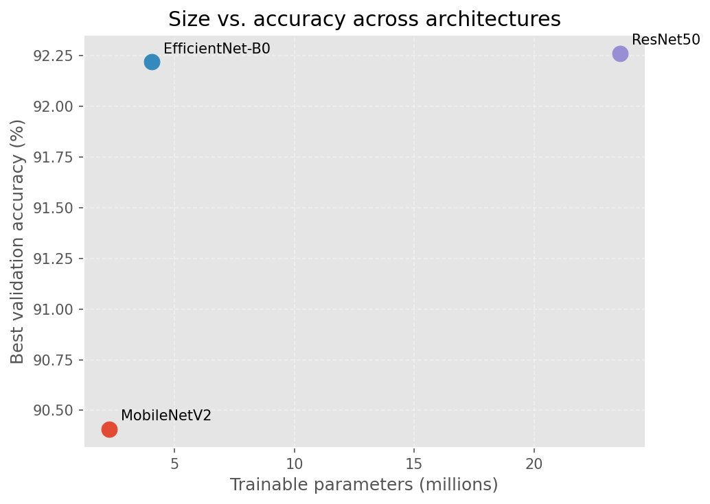

### Accuracy ranking

Best validation accuracy per architecture (filled bar) with test-set top-1 overlaid as a hatched background bar. A large gap between val and test indicates overfitting to the val split during HPO.

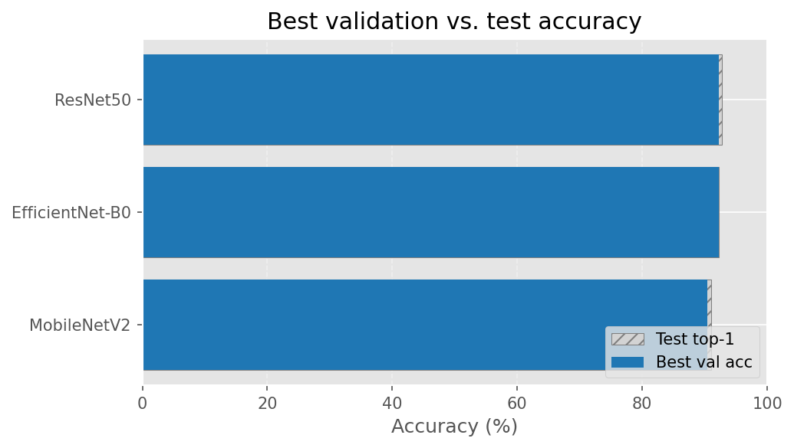

## Per-architecture detail

### MobileNetV2

- **Trials**: 31 total (21 complete, 9 pruned, 0 failed)
- **Best validation accuracy**: 90.41%
- **Test top-1**: 91.06%
- **Test top-5**: 99.25%
- **Parameter count**: 2.3M
- **Best hyperparameters**:
    - `lr`: 0.002173
    - `weight_decay`: 0.0006412
    - `dropout`: 0.1967
    - `batch_size`: 32
    - `optimizer`: sgd
    - `freeze_backbone`: False

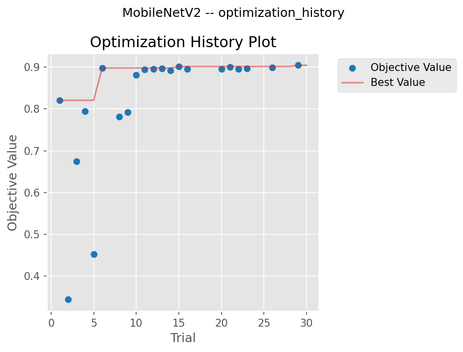

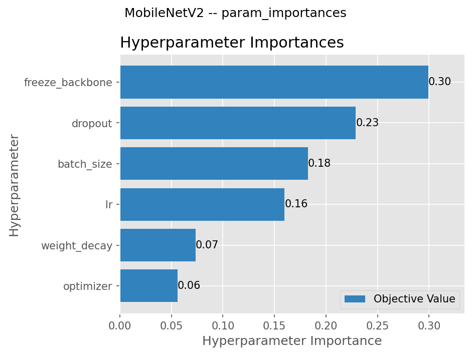

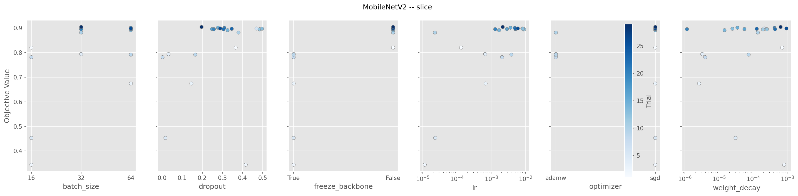

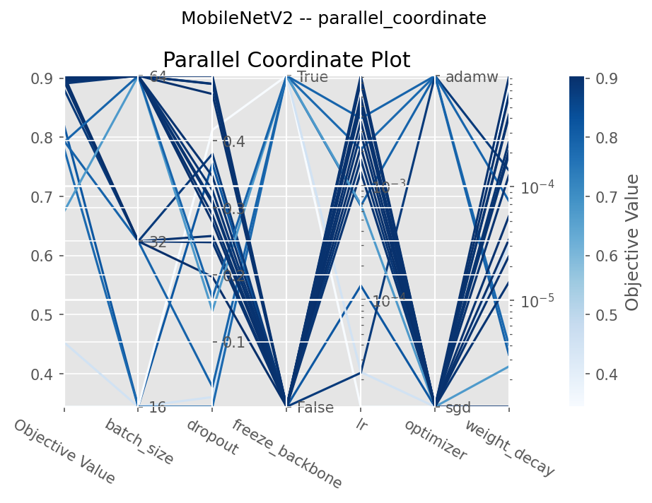

### EfficientNet-B0

- **Trials**: 25 total (15 complete, 10 pruned, 0 failed)
- **Best validation accuracy**: 92.22%
- **Test top-1**: 92.22%
- **Test top-5**: 99.46%
- **Parameter count**: 4.1M
- **Best hyperparameters**:
    - `lr`: 0.008105
    - `weight_decay`: 0.0002115
    - `dropout`: 0.4697
    - `batch_size`: 64
    - `optimizer`: sgd
    - `cosine_lr_schedule`: False

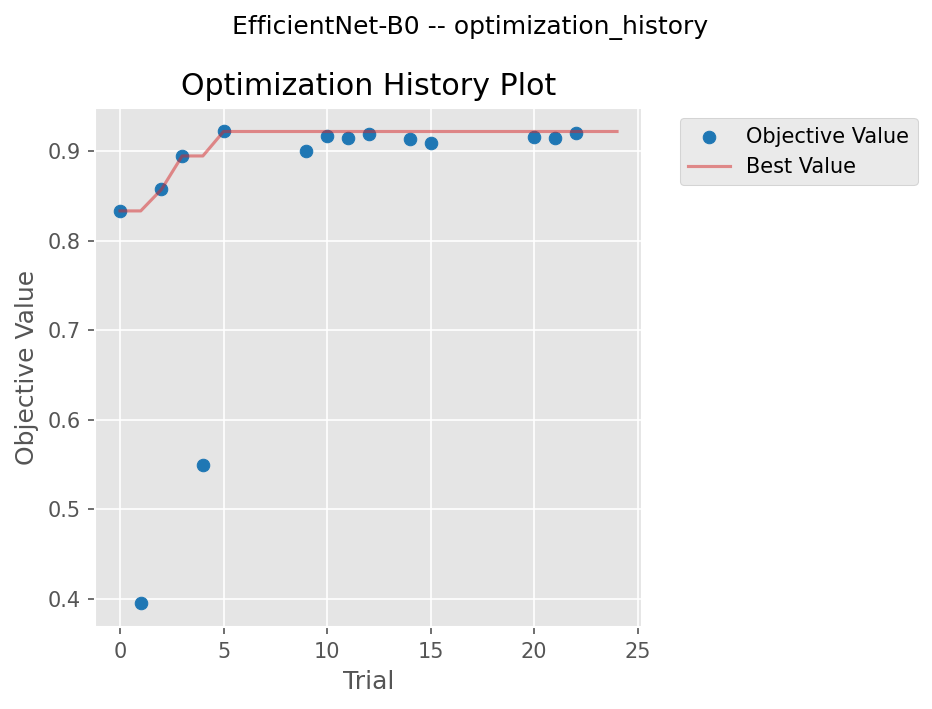

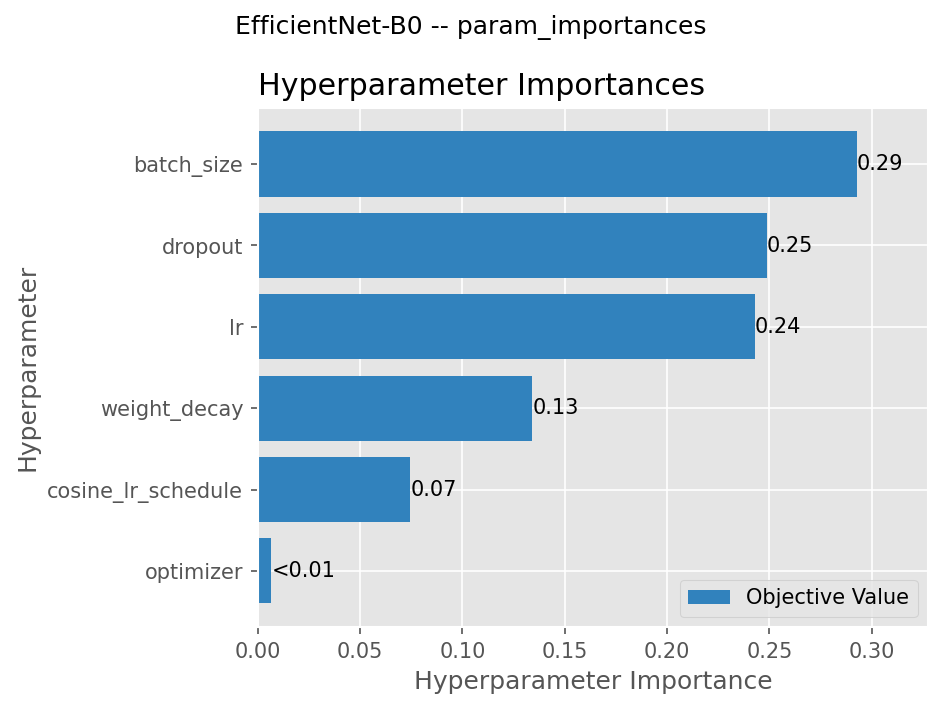

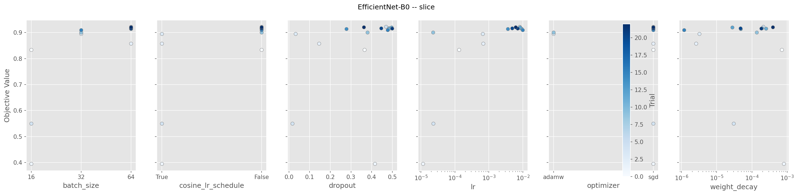

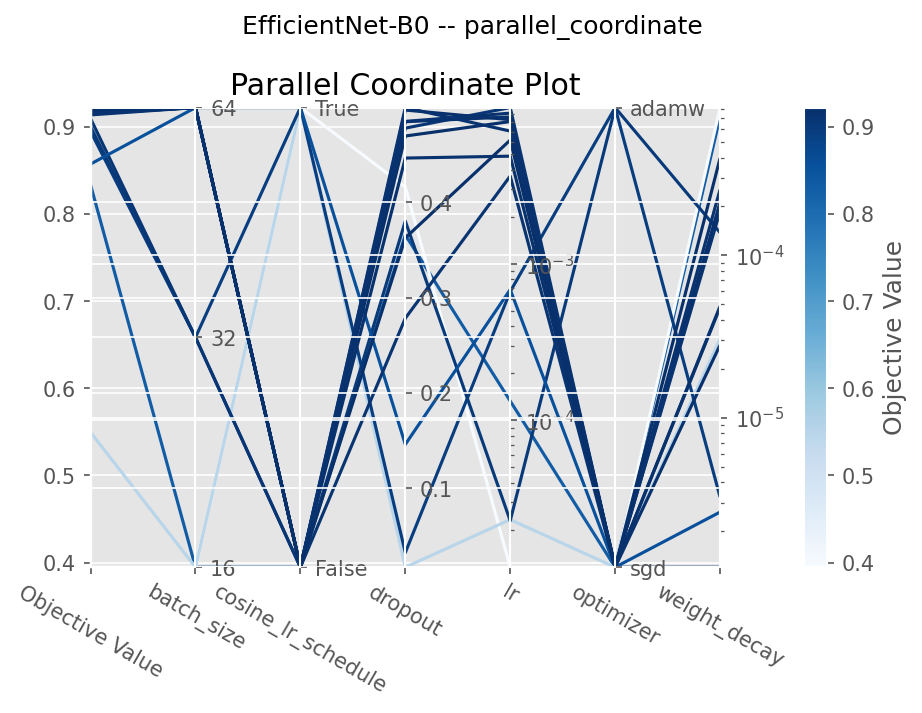

### ResNet50

- **Trials**: 20 total (11 complete, 9 pruned, 0 failed)
- **Best validation accuracy**: 92.26%
- **Test top-1**: 92.72%
- **Test top-5**: 99.29%
- **Parameter count**: 23.6M
- **Best hyperparameters**:
    - `lr`: 4.255e-05
    - `weight_decay`: 1.96e-05
    - `dropout`: 0.1335
    - `batch_size`: 16
    - `optimizer`: adamw
    - `label_smoothing`: 0.09773

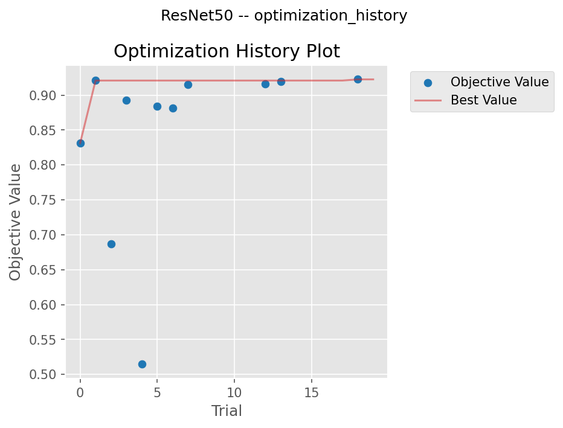

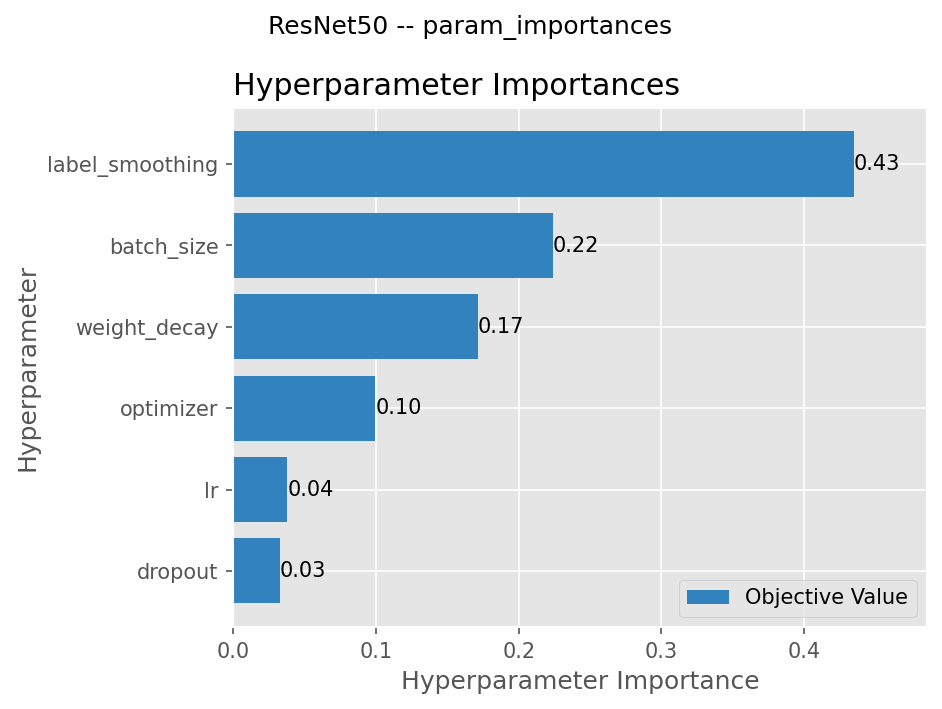

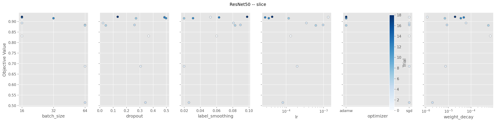

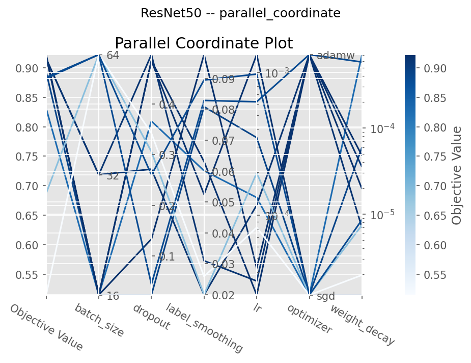
